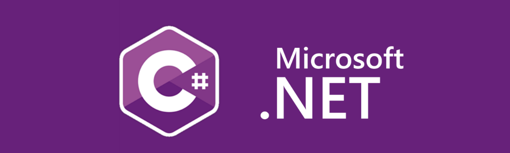

# Curso Microsoft Learn C#

    

## 🎯 Módulo1:  
### [Dê seus primeiros passos com C#](https://docs.microsoft.com/pt-br/learn/paths/csharp-first-steps/)

#
## 🎯 Módulo2 
### [Adicione lógica aos seus aplicativos com C#](https://docs.microsoft.com/pt-br/learn/paths/csharp-logic/)

#
## 🎯 Módulo3
### [Trabalhar com os dados em C#](https://docs.microsoft.com/pt-br/learn/paths/csharp-data/)

#
## 🚀 Sobre
Nestes módulos, que apresentam unidades C# para iniciantes, usamos o Editor do .NET para compor e executar aplicativos. 

Embora o Editor do .NET baseado em navegador seja um ótimo recurso, elimina a necessidade de instalar um ambiente de desenvolvimento como o Visual Studio Code ou o IDE completo do Visual Studio, ele não permite que você crie aplicativos reais.

Se você fosse criar um novo projeto de aplicativo de console do C# no Visual Studio Code (por meio da interface de linha de comando dotnet ou da CLI) ou então no IDE completo do Visual Studio, um arquivo chamado Program.cs contendo o código de um modelo seria gerado.

Para cria aplicativos reais, você escreverá métodos e os organizará em classes e namespaces.

No Editor do .NET baseado em navegador, todo o código que você escreve é executado dentro de um método oculto Main(), que esperamos que tenha diminuído bastante a complexidade de sua experiência inicial.

